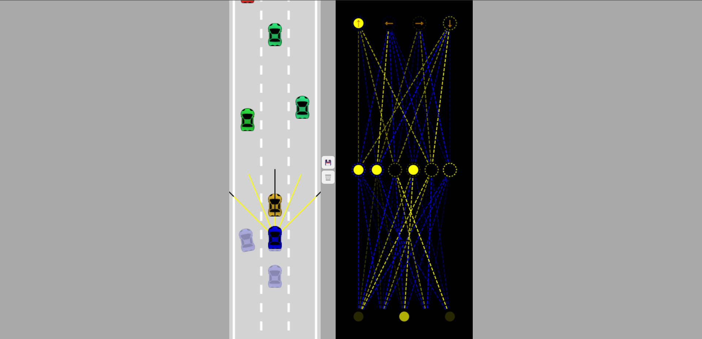

# Self-Driving Car

A self-driving car implemented using vanilla JavaScript is a cutting-edge project that leverages the power of web technologies to create an autonomous vehicle simulation. Using HTML, CSS, and JavaScript, this project involves the development of a virtual road where a car navigates through and avoids traffic. The implementation includes fitness algorithm for path planning, obstacle detection, and decision-making, all coded in pure JavaScript without the need for additional libraries or frameworks. This project showcases the versatility of JavaScript for creating complex and interactive applications, pushing the boundaries of what can be achieved within a web browser environment.



<!-- TABLE OF CONTENTS -->
<details>
  <summary>Table of Contents</summary>
  <ol>
    <li>
      <a href="#about-the-project">About The Project</a>
    </li>
    <li>
      <a href="#getting-started">Getting Started</a>
      <ul>
        <li><a href="#installation">Installation</a></li>
      </ul>
    </li>
    <li><a href="#features">Features</a></li>
    <li><a href="#contributing">Contributing</a></li>
    <li><a href="#license">License</a></li>
    <li><a href="#view-demo">View Demo</a></li>
    <li><a href="#contact">Contact</a></li>
  </ol>
</details>

## Getting Started

### Installation

_Follow the following steps to install and setup the virtual environment._

1. Clone the repo
   ```sh
   git clone https://github.com/Samrat-14/self-driving-car.git
   ```
2. And done! You can get started with the project. Run the index.html with live server.

## Features

- **Pure JavaScript Implementation:** The self-driving car is entirely built using vanilla JavaScript, showcasing the capability of the language to handle complex simulations and algorithms without relying on external libraries or frameworks.
- **Neural Network for Driving Logic:** A simple neural network is integrated into the self-driving car system, allowing it to learn and adapt to different scenarios. The neural network is trained to make real-time decisions based on sensor inputs, enabling the car to navigate through the environment autonomously.
- **Genetic Algorithm for Mutation:** The project employs a genetic algorithm to optimize and evolve the neural network's parameters. Through successive generations, the genetic algorithm fine-tunes the neural network's weights and biases, enhancing the car's ability to make more informed and efficient driving decisions over time.
- **Dynamic Obstacle Avoidance:** The self-driving car demonstrates dynamic obstacle avoidance capabilities. Using sensor inputs and real-time analysis, the system adapts its driving strategy to navigate around moving obstacles, ensuring a safe and efficient journey in a dynamic environment.

## Contributing

I love contributions, so please feel free to fix bugs, improve things, provide documentation.
If you have a suggestion that would make this better, please fork the repo and create a pull request. You can also simply open an issue with the tag "enhancement".
Don't forget to give the project a star! Thanks again!

1. Fork the Project
2. Create your Feature Branch (`git checkout -b feature/AmazingFeature`)
3. Commit your Changes (`git commit -m 'Add some AmazingFeature'`)
4. Push to the Branch (`git push origin feature/AmazingFeature`)
5. Open a Pull Request

<!-- LICENSE -->

## License

Distributed under the MIT License. See `LICENSE` for more information.

## View Demo

Live Demo: [https://samrat-scribesync.vercel.app/](https://samrat-scribesync.vercel.app)

## Contact

Your Name - [Samrat Sadhu](https://samrat-sadhu-portfolio.vercel.app/) - ss2414@ece.jgec.ac.in
